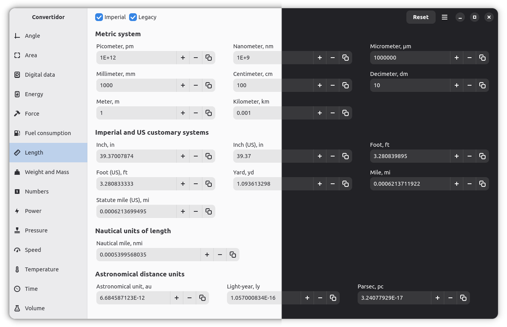

<!-- markdownlint-disable -->
<div align="center">
  
</div>
<h1 align="center">Convertidor</h1>
<p align="center">Convertidor is a handy and high precision application for converting units of measurement.</p>
<p align="center">
  
</p>
<!-- markdownlint-enable -->


## Features

- Conversion of 300+ units of measurement.
- Instant and accurate (synchronous) unit conversion.
- Control of calculation accuracy.
- Intuitive and user-friendly interface.


## Installation

The built packages are available on the [releases](https://github.com/GS90/Convertidor/releases) page.

### Flatpak

The latest official release can be downloaded from Flathub.

<a href='https://flathub.org/apps/details/tech.digiroad.Convertidor'></a>

### GNOME Builder

GNOME Builder offers the easiest method to build and test Convertidor. Clone the repository and press the «Run Project» button to compile.

### Build from source

```
git clone https://github.com/GS90/Convertidor
cd Convertidor

meson setup build
ninja -C build install
```

By default, meson should install Convertidor to `/usr/local`.


## License

Convertidor is a [free software](https://www.gnu.org/philosophy/free-sw.html) and will always be free. It is released under the terms of the [GNU General Public License](./COPYING).


## Copyright

2025-2026, [Golodnikov Sergey](https://github.com/GS90)
