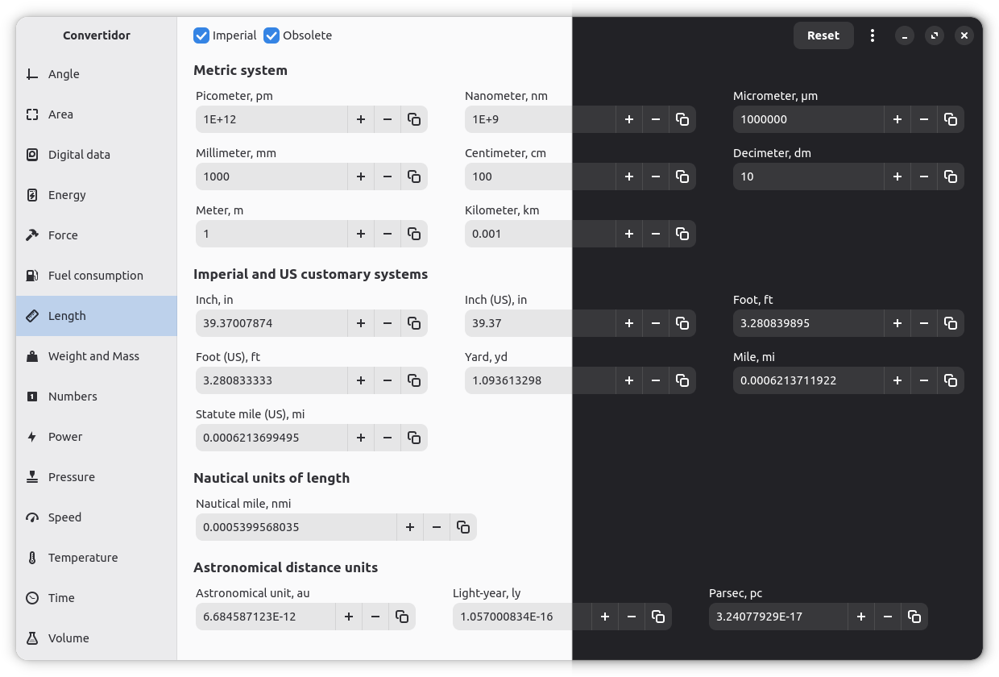

<!-- markdownlint-disable -->

  

<h1 align="center">Convertidor</h1>

Convertidor is a handy and high precision application for converting units of measurement

  

<!-- markdownlint-enable -->

## Features

- Conversion of 300+ units of measurement.
- Instant and accurate (simultaneous) unit conversion.
- Intuitive and user-friendly interface.

## Installation

### Flatpak

The latest official release can be downloaded from Flathub.

### GNOME Builder

GNOME Builder offers the easiest method to build and test Convertidor. Clone the repository and press the «Run Project» button to compile.

## License

Convertidor is a [free software](https://www.gnu.org/philosophy/free-sw.html) and will always be free. It is released under the terms of the [GNU General Public License](./COPYING).

## Copyright

2025, [Golodnikov Sergey](https://github.com/GS90)